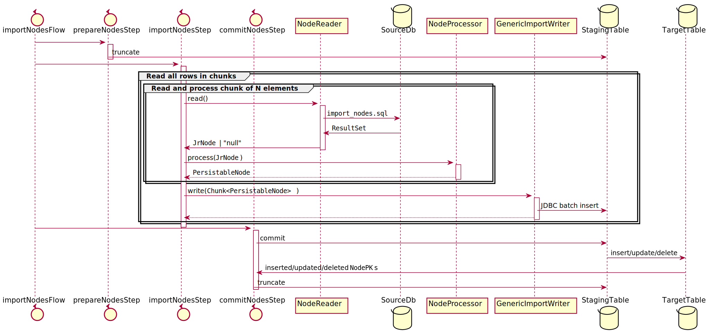

# Jore 3 => Jore 4 importer

This tool implements a batch job for importing data from a Jore 3 database to a Jore 4 database.

## The Structure of the Project

The directory structure of this project follows the [Maven directory layout](https://maven.apache.org/guides/introduction/introduction-to-the-standard-directory-layout.html).

The package structure of this application is described in the following:

* The `fi.hsl.jore.importer.config` package contains the configuration classes which configure the Spring context
  which is started when this application is run. It has the following sub packages:
  * The `fi.hsl.jore.importer.config.jackson` package configures the [Jackson datatype module for Vavr](https://github.com/vavr-io/vavr-jackson).
  * The `fi.hsl.jore.importer.config.jobs` package configures the Spring Batch jobs which import data from the Jore 3 database
    to the Jore 4 database.
  * The `fi.hsl.jore.importer.config.jooq` package configures the jOOQ integration of Spring Boot.
  * The `fi.hsl.jore.importer.config.migration` package configures Flyway which is used to the database migration scripts.
  * The `fi.hsl.jore.importer.config.profile` package specifies the different Spring profiles used by this application.
  * The `fi.hsl.jore.importer.config.properties` package contains configuration read from the properties files.
* The `fi.hsl.jore.importer.feature` package contains the implementation of the import jobs. It has the following
  sub packages:
  * The `fi.hsl.jore.importer.feature.api` package contains the implementation of the REST api which allows you to
    start the import job and query the status of the previous import job.
  * The `fi.hsl.jore.importer.feature.batch` package contains the custom components which are used by Spring Batch.
    These components include tasklets, row mappers, item processors, and item readers.
  * The `fi.hsl.jore.importer.feature.common` package contains general utility code which is used by several other classes.
  * The `fi.hsl.jore.importer.feature.infrastructure` package contains repositories which insert infrastructure data
    into the target database.
  * The `fi.hsl.jore.importer.feature.jore3` package contains classes which contain the information that's read from the source
    database.
  * The `fi.hsl.jore.importer.feature.network` package contains repositories which insert network data into the
    target database.
  * The `fi.hsl.jore.importer.feature.system.repository` package contains a repository which allows you to current
    date and time information from the database.
* The `fi.hsl.jore.importer.util` package provides factory methods which allow you to instantiate classes
  provided by the [JTS topogy suite](https://github.com/locationtech/jts).

The content of the _src/main/resources_ directory is described in the following:

* The _configuration_ directory contains properties files which configure the used database connections
  and the jOOQ integration of Spring Boot.
* The _db/migration_ directory contains the Flyway database migrations.
* The _import_ directory contains the SQL scripts which read the imported data from the
  source MSSQL database.

## Import job(s)

The import jobs are implemented by using Spring Batch. If you are not familiar with Spring Batch, you should take a
look a the [Spring Batch reference documentation](https://docs.spring.io/spring-batch/docs/4.3.x/reference/html/index.html).

### Importing Jore 3 data (`importJoreJob`)

An import job which imports data from the Jore 3 database has the following steps:

* The `prepareStep` cleans the data found from the staging tables.
* The `importStep` reads the imported data from the source MSSQL database and inserts the imported data into the
  staging table found from the target PostgreSQL database.
* The `commitStep` moves the data from the staging table to the actual target table.

It's important to understand that the job which import data from the Jore 3 database to the importer's database don't follow 
[the chunk oriented processing "pattern" of Spring Batch](https://docs.spring.io/spring-batch/docs/current/reference/html/step.html#chunkOrientedProcessing). 
Even though these jobs use chunk oriented processing for transferring data from Jore 3 database to importer's staging tables (`importStep`), 
these jobs also use a tasklet which copy the imported data from the staging table to the target table. Because the final transfer is 
performed inside one transaction (`commitStep`), no information is transferred to the target table if an error occurs during that transaction.

The following figure identifies the steps of the import jobs:


### Overview of a Generic Job

A single Spring Batch job consists of the following components:

* A `Job` contains the steps which are invoked when a batch job is run.
* The `GenericCleanupTasklet` cleans the staging tables before the import process is run. This step
  is called the prepare step.
* The `JdbcCursorItemReader<ROW>` class reads the imported data from the source MSSQL database by using an SQL
  script which is found from _src/main/resources/import_ directory. This component is run during the import step.
* An implementation of the `ItemProcessor<ROW, ENTITY>` interface transforms the source data into a format which can be inserted into the
  staging table found from the target PostgreSQL database. This component is run during the import step.
* The `GenericImportWriter<ENTITY, KEY>` class writes the imported data into the staging table which is found
  from the target PostgreSQL database. The actual insert logic is found from the implementation of the
  `IImportRepository<ENTITY,KEY>` interface. This component is also run during the import step.
* The `GenericCommitTasklet` object is run during the import step, and it moves the data from the staging table to the
  real target table. The logic which moves the imported data is found from the `commitStagingToTarget()` method of the
  `IImportRepository<ENTITY,KEY>` interface. The implementations of this interface must extend the `AbstractImportRepository<ENTITY,KEY>`
  class which contains three abstract methods:
  * The `delete()` method contains the logic which deletes rows from the target table. A row is deleted from the target
    table if it's found from the target table and it's not found from the staging table.
  * The `insert()` method contains the logic which inserts new rows into the target table. A row is inserted to the target table
    if it's found from the staging table and it's not found from the target table.
  * The `update()` method contains the logic which checks if a row is found from the target and staging tables, and
    replaces the information found from the target table with the information found from the staging table.
    Beware that changed rows cannot be properly identified in all tables in the Jore 3 database because of the lack of
    appropriate keys. This means that in some cases a row change is interpreted as a deletion and insertion. One example
    for this is the line header, and this phenomenon had to be taken into account in
    [the related tests](src/test/java/fi/hsl/jore/importer/feature/batch/line_header/support/LineHeaderImportRepositoryTest.java).

The following figure illustrates the responsibilities of these components:


#### Importing nodes (`jr_solmu`)



#### Importing links (`jr_linkki`)


#### Importing points (`jr_piste`)


#### Importing lines (`jr_linja`)


### Importing Data to Jore 4

This application imports scheduled stop points, lines, routes, journey patterns, and stops of journey patterns
to the Jore 4 database. The data which is imported to Jore 4 is written to the Jore 4 database one row at a time. 
If an error occurs, the erroneous row is written to the log and the import process starts to process the next row 
found from the database of the importer application.

The following sections identify the non-obvious assumptions made by the import process.

#### Scheduled Stop Points

The process that imports scheduled stop points to Jore 4 follows these rules:

* The imported stop points are sorted in ascending the order by using the external id (Jore 3 id). If multiple scheduled
  stop points have the same short id, the first one is transferred to Jore 4. This ensures that multiple stop points
  with the same short id and validity period cannot be transferred to Jore 4.
* If the ely number of a scheduled stop point isn't found from the database of the importer, it won't be transferred
  to Jore 4.
* If the information of a scheduled stop point isn't found from Digiroad, it won't be transferred to Jore 4.
* The import process ignores Digiroad stop points which have invalid information (such missing or empty ely number).

## Coding Conventions

This section identifies the coding conventions which you must follow when you are writing either production or test code
for this project. These coding conventions are described in the following:

* You must use the `final` keyword when you declare fields, local variables, constructor arguments, or method parameters
  whose value cannot be changed after it has been assigned for the first time.
* When you add new fields to entities or data transfer objects, you must follow these
  rules:
  * If the field value cannot be `null`, you must use primitive types when possible (e.g. `int`). 
  * If the field value is optional, you must use `java.util.Optional` (e.g. `Optional<Integer>` or `Optional<String>`)
* Tag nullable method parameters and return values with the `@Nullable` annotation. You don't have to annotate non-null
  parameters and return values because every method parameter and return value is non-null by default (see
  the next coding convention). 
* Every package must include the `package-info.java` file which declares that every field, method parameter, or
  return value is non-null by default (see the code example 1 for more details).
* Use only immutable DTO's by introducing interfaces annotated with `org.immutables` annotations.
* You must use Vavr collections instead of `java.util` collections when possible.
* You must use the `java.util.Optional` instead of the `io.vavr.control.Option`.

**Code example 1: package-info.java**

```
@NonNullApi
@NonNullFields
fi.hsl.jore.foo.bar

import org.springframework.lang.NonNullApi;
import org.springframework.lang.NonNullFields;
```

## Configuration

The importer application is configured by using profile specific configuration files. These configuration files are
found from the profile specific directories which are found from the _profiles_ directory. At the moment this application
has the following profiles:

* `ci`. This profile is used by the Github Actions workflows which run our CI jobs.
* `dev`. This profile should be used in the local development environment. This is also the
  default profile which is used by Maven if the active profile isn't specified.
* `prod`. This profile is used by the Docker image which runs the importer application.

Each one of these directories contains one _config.properties_ file which contains the profile
specific configuration of the importer application. The different configuration options are described
in the _profiles/dev/config.properties_ file.

## Running the app locally

### Setup

1. Install software that's is required to compile and run the importer application and its dependencies.
   Before you can run this application, you must install these tools:
   - Docker Desktop
   - OpenJDK 11
   - Maven
2. Make a copy of the maven `dev`-profile for your user:
    ```
    cp profiles/dev/config.properties profiles/dev/config.<my-username>.properties
    ```

   Look up the jore3 database credentials from the Azure vault (e.g. `hsl-jore3-db-username` and `hsl-jore3-db-password`
   in the `hsl-jore4-dev-vault`) and insert them into your maven profile's `source.db.XXX` definitions.
3. Adjust the `source.db.*` properties in `profiles/dev/config.<my-username>.properties` to your needs. Other configuration for destination database and test database may also be found from here.
4. If you wish to connect to the original Jore 3 database, follow the instructions [here](https://github.com/HSLdevcom/jore4/blob/main/wiki/onboarding.md#creating-an-ssh-configuration-entry) on how to create a tunnel and connect to the database. After the tunnel is created, the Jore 3 database will be available on localhost:56239. Ask for the username and password from the project team.

   During the importer run, the shell on the bastion host needs to be "touched" in regular intervals to keep it from timing out. (The `TMOUT` environment variable on the bastion host cannot be modified.) "Touching" can be done manually by issuing key presses into the shell every few minutes. Alternatively, you can start a new subshell with the timeout disabled to keep the session open:
   ```
   env TMOUT=0 bash
   ```
5. Clone the [jore4-digiroad-import](https://github.com/HSLdevcom/jore4-digiroad-import) repository and 
   follow these steps:
   1. Run the Digiroad import.
   2. Export infrastructure links from the data imported from Digiroad and import these links to the Jore 4 database.
   3. Export scheduled stop points from the data imported from Digiroad and write the exported data to a CSV file.
6. Configure the absolute path of the CSV file which contains scheduled stop points exported from Digiroad in the 
   profile specific configuration file.

### Run 

The `development.sh` is a simple utility script for starting the development and test dependencies (e.g. databases).

The dependencies must be up and running for both running this app locally or for running tests. Note that for generating the jooq classes for build, the test database must be running. Run `./development.sh start:deps`

Most of the runtime environment is configured in `profiles/dev/config.<my-username>.properties`. However, some values must be supplied manually:

- `JORE_IMPORTER_MIGRATE`: At the moment this app requires that the destination database is already up-to-date (e.g. database migrations are handled by another party). If `JORE_IMPORTER_MIGRATE` is set to `true`, this app will perform the migrations. This should only be enabled in local development when using the dockerized local database!

You can use the provided `run-local.sh` script for running the importer, which supplies this argument.

The importer will be available through http://localhost:8080. See instructions below on how to trigger importing through the HTTP API.

## Running the app in docker-compose

You may wish to test whether the application works as a container in a docker network. Spin up the dependencies and 
the app itself with `development.sh start`

The importer will be available through http://localhost:3200. See instructions below on how to trigger importing through the HTTP API.

## Building the app

The application is using jooq for ORM. To (re)generate the mapping classes, you need to have the ORM source database to
be up and running and jooq connecting to it. `./development.sh generate:jooq` spins up the database and generates the
ORM classes.

Note that the `dev` profile is only meant for use in your local development environment. To create a build to be used for deployment, compile and create a package using the `prod` profile:
```
mvn clean package spring-boot:repackage -Pprod
```

## Docker reference

The application uses spring boot which allows overwriting configuration properties as described
[here](https://docs.spring.io/spring-boot/docs/current/reference/html/features.html#features.external-config.typesafe-configuration-properties.relaxed-binding.environment-variables).
The docker container is also able to
[read secrets](https://github.com/HSLdevcom/jore4-tools#read-secretssh) and expose
them as environment variables.

The following configuration properties are to be defined for each environment:

| Config property       | Environment variable       | Secret name                | Example                                                                          | Description                                                                    |
| --------------------- | -------------------------- | -------------------------- | -------------------------------------------------------------------------------- | ------------------------------------------------------------------------------ |
| -                     | SECRET_STORE_BASE_PATH     | -                          | /mnt/secrets-store                                                               | Directory containing the docker secrets                                        |
| source.db.url         | SOURCE_DB_URL              | source-db-url              | jdbc:sqlserver://localhost:1433;database=testsourcedb;applicationIntent=ReadOnly | The jdbc url of the source JORE3 MSSQL database                                |
|                       | SOURCE_DB_HOSTNAME         | source-db-hostname         | localhost                                                                        | The IP/hostname of the source database (if SOURCE_DB_URL is not set)           |
|                       | SOURCE_DB_PORT             | source-db-port             | 1433                                                                             | The port of the source database (if SOURCE_DB_URL is not set)                  |
|                       | SOURCE_DB_DATABASE         | source-db-database         | testsourcedb                                                                     | The name of the source database (if SOURCE_DB_URL is not set)                  |
| source.db.username    | SOURCE_DB_USERNAME         | source-db-username         | sa                                                                               | Username for the source database                                               |
| source.db.password    | SOURCE_DB_PASSWORD         | source-db-password         | \*\*\*\*                                                                         | Password for the source database                                               |
| importer.db.url       | IMPORTER_DB_URL            | importer-db-url            | jdbc:postgresql://localhost:5432/devdb?stringtype=unspecified                    | The jdbc url of the importer's PostgreSQL database                             |
|                       | IMPORTER_DB_HOSTNAME       | importer-db-hostname       | localhost                                                                        | The IP/hostname of the importer's database (if IMPORTER_DB_URL is not set)     |
|                       | IMPORTER_DB_PORT           | importer-db-port           | 5432                                                                             | The port of the importer's database (if IMPORTER_DB_URL is not set)            |
|                       | IMPORTER_DB_DATABASE       | importer-db-database       | devdb                                                                            | The name of the importer's database (if IMPORTER_DB_URL is not set)            |
| importer.db.username  | IMPORTER_DB_USERNAME       | importer-db-username       | postgres                                                                         | Username for the importer's database                                           |
| importer.db.password  | IMPORTER_DB_PASSWORD       | importer-db-password       | \*\*\*\*                                                                         | Password for the importer's database                                           |
| jore4.db.url          | JORE4_DB_URL               | jore4-db-url               | jdbc:postgresql://localhost:5432/jore4e2e?stringtype=unspecified                 | The jdbc url of the jore4 target PostgreSQL database                           |
|                       | JORE4_DB_HOSTNAME          | jore4-db-hostname          | localhost                                                                        | The IP/hostname of the jore4 target database (if JORE4_DB_URL is not set)      |
|                       | JORE4_DB_PORT              | jore4-db-port              | 5432                                                                             | The port of the jore4 target (if JORE4_DB_URL is not set)                      |
|                       | JORE4_DB_DATABASE          | jore4-db-database          | jore4e2e                                                                         | The name of the jore4 target (if JORE4_DB_URL is not set)                      |
| jore4.db.username     | JORE4_DB_USERNAME          | jore4-db-username          | dbimporter                                                                       | Username for the jore4 target                                                  |
| jore4.db.password     | JORE4_DB_PASSWORD          | jore4-db-password          | \*\*\*\*                                                                         | Password for the jore4 target                                                  |
|                       | DIGIROAD_STOPS_CSV_VERSION | digiroad-stops-csv-version | 2022-02-03                                                                       | Version of digiroad stops csv file to be downloaded from Azure blob storage    |
| jore.importer.migrate | JORE_IMPORTER_MIGRATE      | jore-importer-migrate      | false                                                                            | Should the importer should run its own migrations (for local development only) |

More properties can be found from `/profiles/prod/config.properties`

## Running tests

For running the tests, you need to have the test databases up an running:
```sh
./development.sh start:deps
```

Then start the tests with:
```sh
mvn --batch-mode clean verify
```

## Triggering the batch job

The import can be triggered using a HTTP API. The `POST /job/import/start` endpoint will start the job and return its status. If a previous job instance was already running, a new job is not started and the return value will reflect the status of the running job.

```shell
$ curl -X POST http://localhost:8080/job/import/start/
{"id":0,"batchStatus":"STARTING","exitCode":"UNKNOWN","exitDescription":null,"startTime":null,"endTime":null}
```

### Querying the status of the latest import

The `GET /job/import/status` endpoint returns information about the latest import. If no import has been performed, a HTTP 204 status is returned.

While the import is running:

```shell
$ curl http://localhost:8080/job/import/status/
{"id":5,"batchStatus":"STARTED","exitCode":"UNKNOWN","exitDescription":null,"startTime":"2021-04-09T08:35:51.560Z","endTime":null}
```

After the import is complete:

```shell
$ curl http://localhost:8080/job/import/status/
{"id":5,"batchStatus":"COMPLETED","exitCode":"COMPLETED","exitDescription":null,"startTime":"2021-04-09T08:35:51.560Z","endTime":"2021-04-09T08:36:11.308Z"}
```

If an error occurs:

```shell
$ curl http://localhost:8080/job/import/status/
{"id":5,"batchStatus":"FAILED","exitCode":"FAILED","exitDescription":"<here's a really long Java stack trace>","startTime":"2021-04-09T08:39:47.698Z","endTime":"2021-04-09T08:41:17.761Z"}
```

## Known Problems

### Test case fails because a database object isn't found

If a test case fails because the `com.microsoft.sqlserver.jdbc.SQLServerException` is thrown and
the error message says that it cannot find a database object, the problem is that the script which
creates the source MSSQL database (_docker/mssql_init/populate.sql_) was changed. You can solve this problem by running the command: 
`./development.sh recreate` at command prompt.
